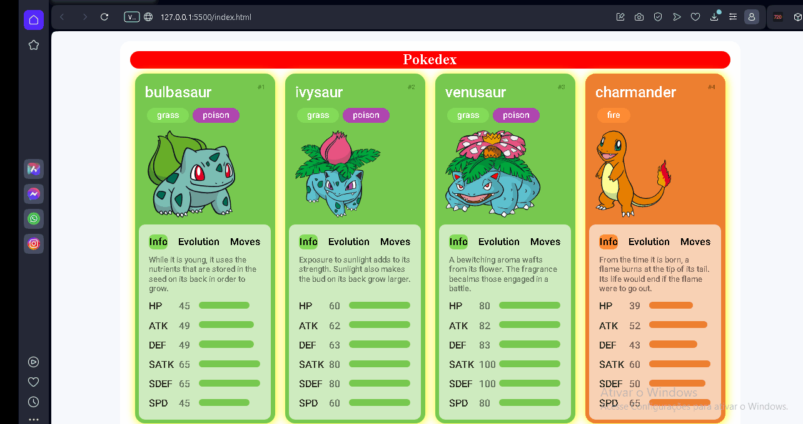

# Trilha JS Developer - Pokedex
<h2>Projeto concluido!</h2>

 
Implementação das caracteristicas do pokemon e informações!

Teconologias Utilizadas

HTML5| CSS3| JAVASCRIPT

 

 
  
    
     

   
